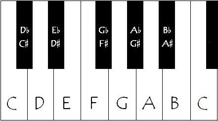
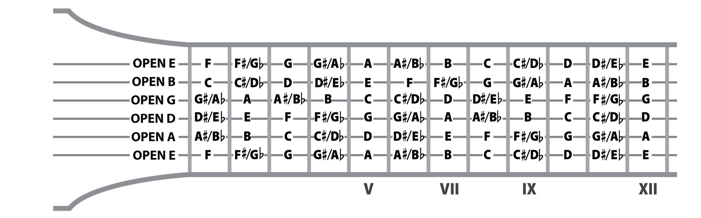

# Scales and Chords

## Notes, Semitones and Tones

In Western Music, we have 12 notes:

``C C#/Db D D#/Eb E F F#/Gb G G#/Ab A A#/Bb B C``

On the piano they are laid out like this:



The "musical distance" (also called interval) between a key on the piano and the key right next to it (for example from ``B`` to ``C`` or ``D`` to ``D#/Eb``) is called a **semitone**. The distance between a key on the piano and another key leaving one key in between (for example from ``C`` to ``D`` or from ``E`` to ``F#/Gb``) is called a **tone**. One tone equals two semitones.

The notes without sharps or flats (``#``'s or ``b``'s) are on the white keys of the piano and are called the **natural notes**. The notes with sharps or flats are on the black keys are called the **accidental notes**.

On the guitar, unlike the piano, we don't have a visual distinction between natural and accidental notes. However, similarly to adjacent keys on the piano, the interval between one fret and the next is always a semitone.

The layout of notes on the guitar is a little more complicated than on the piano, but it helps to know that when you have a note if you move a fret closer to the bridge you will be one semitone higher and if you move a fret closer to the nut you will be one semitone lower.



## Intervals

An **interval** is simply the "musical distance" between two notes. An interval has two properties, the number and the quality. The number comes from how many letter names are in the sequence between the two notes of the interval, including both notes forming the interval. For example, the interval between ``C`` and ``D`` is a second because there are two notes (``C`` and ``D``) in the sequence. The interval from a note to itself, for example from ``D`` to ``D`` is called an unison, since there is only one note in the sequece, ``D``. The interval between ``E`` and ``G`` is a third (three notes, ``E F G``), the interval between ``A`` and ``D`` is a fourth (four notes, ``A B C D``), the interval between ``F`` and ``C`` is a fifth (five notes ``F G A B C``), between ``B`` and ``G`` we have a sixth (six notes, ``B C D E F G``) and between ``D`` and ``C`` we have a seventh (seven notes, ``D E F G A B C``). Since the notes names repeat, a interval from a note to another note of the same name higher up on the piano (or closer to the bridge/on a thinner string on the guitar) is called an octave. For instance the interval from ``C`` to ``C`` is an octave, because we have eight notes, ``C D E F G A B C``. Intervals larger than an octave are called **compound intervals** but we don't have to worry about them for now.

The exact number of semitones that make up an interval gives the interval its quality. Intervals can be **perfect**, **major**, **minor**, **augmented** or **diminished**. The most common qualities we will encounter are perfect, major and minor. We can have perfect fourths, fifths and octaves. We can have major and minor seconds, thirds, sixths and sevenths. All interval numbers can be augmented or diminished but those are more rare and we won't need them for the following discussion, with the exception of the augmented fourth which is important and usually called the **tritone**. Below are some common intervals and the exact number of semitones they contain:

* Perfect unison - 0 semitones
* Minor second - 1 semitone
* Major second - 2 semitones (or 1 tone)
* Minor third - 3 semitones (or 1 tone and one semitone)
* Major third - 4 semitones (or 2 tones)
* Perfect fourth - 5 semitones (or 2 tones and one semitone)
* Augmented fourth - 6 semitones (or 3 tones, that's why this interval is also called a tritone)
* Perfect fifth - 7 semitones (or 3 tones and one semitone)
* Minor sixth - 8 semitones (or 4 tones)
* Major sixth - 9 semitones (or 4 tones and one semitone)
* Minor seventh - 10 semitones (or 5 tones)
* Major seventh - 11 semitones (or 5 tones and one semitone)
* Perfect octave - 12 semitones (or 6 tones)

Note that we usually call the perfect octave simply "octave", since augmented or diminished octaves are quite rare so the "perfect" is assumed.

## Scales

A scale is an organized sequence of notes. You can also think of a scale as a pattern of intervals between notes. The most important scale for Western Music is the **major scale**. The pattern of intervals in the major scale is as follows:

``Tone Tone Semitone Tone Tone Tone Semitone``

We will now abbreviate tone as "T" and semitone as "ST".

So, if we start from any note and follow this pattern, we get a major scale. Therefore, there are 12 different major scales. Let's start with ``C``:

```java
    C  D  E  F  G  A  B  C
     T  T  ST T  T  T  ST
```

That's the C major scale! Also note that those are the natural notes, or the white keys on the piano.

Let's try starting on another note, this time ``G``:

```java
    G  A  B  C  D  E  F# G
     T  T  ST T  T  T  ST
```

That's the G major scale. Note that we have an accidental note in there, but it is still a major scale because we followed the pattern of ``T T ST T T T ST``.

There are many other scales (natural minor, harmonic minor, major pentatonic, minor pentatonic, diminished, whole-tone, etc) but the major scale is the most important one to learn first.

## Chords

A **chord** consists of two or more notes played together. Most chords that we use are made up of thirds, both major and minor. Usually we use three notes to form a chord, a three note chord is called a **triad**. So most triads are then created by "stacking" two thirds. 

The types of thirds inside of the chord determine its quality. Since we have two types of thirds (major and minor) and two thirds per chord, we have four different combinations, giving us four different types of triads: **major**, **minor**, **augmented**, **diminished**.
The make-up of intervals of each quality is as follows:

| Chord quality | Intervals                 |
|---------------|---------------------------|
| Major         | Major Third + Minor Third |
| Minor         | Minor Third + Major Third |
| Diminished    | Minor Third + Minor Third |
| Augmented     | Major Third + Major Third |

We can construct chords out of the major scale. Let's work with the C major scale for now. To construct chords out of the C major scale, we start on each note of the scale and then stack two third intervals on top of that note, using only notes that belong to the scale. For example, starting with ``C`` we have ``C E G`` (there is a third between ``C`` and ``E`` and a third between ``E`` and ``G``). If we follow the same process for every note of the scale, we end up with the following chords:

| Starting Note | Chord  | Quality     |
|---------------|--------|-------------|
| C             | C E G  | Major       |
| D             | D F A  | Minor       |
| E             | E G B  | Minor       |
| F             | F A C  | Major       |
| G             | G B D  | Major       |
| A             | A C E  | Minor       |
| B             | B D F  | Diminished  |
